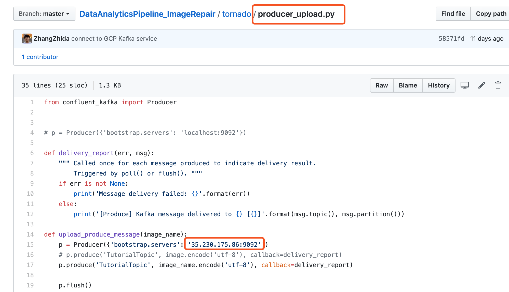

#DataAnalyticsPipeline_ImageRepair
## Member
Han Ding ()  
Lehui Liu (ll3238)    
Xuehan Zhao (xz2790)  
Zhida Zhang ()   

## Links
[Project Github](https://github.com/ZhangZhida/DataAnalyticsPipeline_ImageRepair/tree/master/database_service)  
[Jira](https://toydemoproject.atlassian.net/jira/software/projects/IM/boards/13)  

## MVP Architecture

## Environment preparation

-1. Start a new conda environment. The following steps will all be executed in this new conda environment.

-2. First, RUN >> pip install -r requirements.txt  
You will also need to set up deep learning environment for the backend server. We recommend using the [EC2 Deep learning AMI](https://aws.amazon.com/cn/blogs/machine-learning/get-started-with-deep-learning-using-the-aws-deep-learning-ami/) on AWS. 

-3. Install Kafka on your server, we use GCP as the Kafka server. 
You can change your own server ip here.

-4. Start the kafka service on your server. Then, create a topic named "TutorialTopic" for our project. This Kafka topic will be used by our producer and consumers. You could follow this [office guide] (https://kafka.apache.org/quickstart). 

-5. Set up your local config.ini file. Firstly, copy config_example.ini to config.ini. Then set up your secret variable value in config.ini file.  

## RUN the application

-1. Start a terminal, go to PROJECT\_FOLDER/tornado, and RUN >> python main.py, to start our tornado web service, including backend and model predict RESTful API.

-2. Start a new terminal, go to PROJECT\_FOLDER/database\_service, and RUN >> python history.py, to start our history table service. This is where we track user info and image info. 

-3. Start the front-end service. When you download the whole project, you can access the front-end in the PROJECT\_FOLDER/front\_end. 

-4. Click on upload image and brush the part you don't want. When your are set, click Go! 
  

  
-5. The result image will show on the right.

## Close up 

-1. Close your Kafka service  
-2. Shut down the backend service
