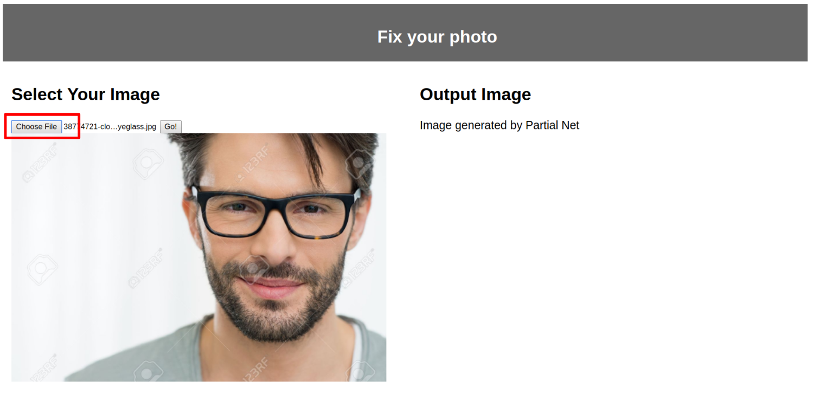
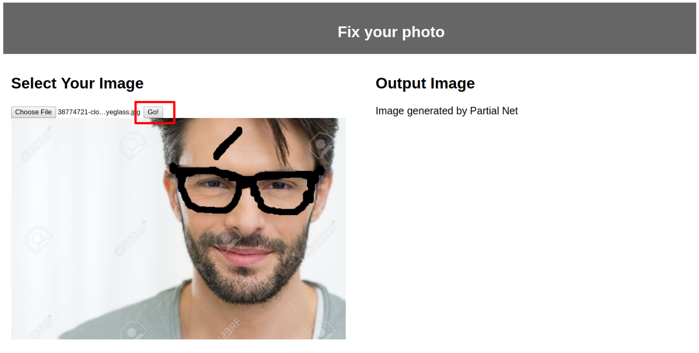
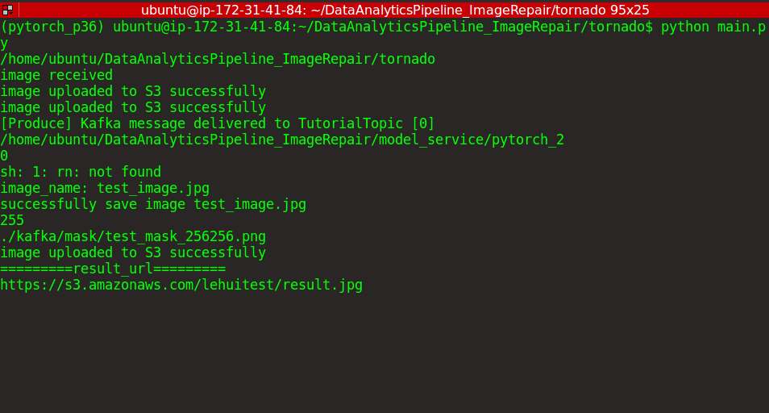

# DataAnalyticsPipeline_ImageRepair

**Description**: 

We proposed a Project: Image Reconstruction Web Application. In this MVP product, we provide the user to remove and reconstruct a certain part of the input picture, say, remove the sunglasses of a selfie. This web application takes power of partialconv net proposed by NVIDIA(https://github.com/NVIDIA/partialconv). The model service of this project is in another repository by our group member Han Ding: https://github.com/DH-Diego/Homework4995.009DAP/tree/master/final

## Members
- Han Ding (hd2412)  
- Lehui Liu (ll3238)    
- Xuehan Zhao (xz2790)  
- Zhida Zhang (zz2578)   

## Links
[Project Github](https://github.com/ZhangZhida/DataAnalyticsPipeline_ImageRepair/tree/master/database_service)  
[Jira](https://toydemoproject.atlassian.net/jira/software/projects/IM/boards/13)  

## MVP Architecture

1. Web Frontend: the user can upload a picture, brush on the part they want to remove, click the "Go" button and get the reconstruction result on the right hand side of webpage. 
2. Tornado Server: this server process the HTTP request, mainly /reconstruct
3. Kafka: We run kafka service on a cloud GCP machine. It has a topic TutorialTopic. Once the tornado receive a /reconstruct POST request, it will produce a event with the user_id, timestamp, image url (we upload it to S3) to the kafka server.
4. History service: this service is to store the user history. We want to track the user upload and image reconstruction for further study in the future. 
5. Database: we use a cloud database MySQL running on AWS to store the user history.
6. Model service:
   * predict: given an original image, and a mask (the image part we want to reconstruct), we run the partialconv net model and output a successfully reconstructed image. 
   * train: the model we have is trained on ImageNet which is not domain-wise enough. We want to have a train service that take in like 200 domain-specific images, finetune the model and then have a better predicting effect on further new images in this domain. 

## Environment preparation

1. Start a new conda environment. The following steps will all be executed in this new conda environment.

2. First, RUN >> pip install -r requirements.txt  
You will also need to set up deep learning environment for the backend server. We recommend using the [EC2 Deep learning AMI](https://aws.amazon.com/cn/blogs/machine-learning/get-started-with-deep-learning-using-the-aws-deep-learning-ami/) on AWS.

3. Install Kafka on your server, we use GCP (35.238.175.86) as the Kafka server.
   * You can change your own server ip here.

   * Start the kafka service on your server. Then, create (if not exists) a topic named "TutorialTopic" for our project. This Kafka topic will be used by our producer and consumers. You could follow this [office guide] (https://kafka.apache.org/quickstart).

4. Config and start MySQL database service. Firstly, copy config_example.ini to config.ini. Then set the MySQL configuration in the config.ini file. Since our MySQL db is lively served on AWS, we don't need explicitly start it.  

## RUN the application

1. On **Machine 1**, we run the **Tornado Web Service && Model Service**. Start a terminal, go to PROJECT\_FOLDER/tornado, and RUN >> python main.py, to start our tornado web service, including backend and model predict service. 

2. On **Machine 2**, we run the **User History Service**. Start a new terminal, go to PROJECT\_FOLDER/database\_service, and RUN >> python history.py, to start our history table service. This is where we track user info and image info. 

3. On **Machine 3**, start the **Kafka Server**. Here, Kafka producer will produce event with user history info, and Kafka consumer in User History service will consume the event and store the user history to MySQL database. To monitor the events, run command "sudo systemctl start kafka && ./kafka/bin/kafka-console-consumer.sh --bootstrap-server 35.230.175.86:9092 --topic TutorialTopic". 

4. On **Machine 4**, Start the **Front-end Service**. Here, frontend service and backend services are seperated. When you download the whole project, you can access the front-end in the PROJECT\_FOLDER/front\_end. 

5. Click on upload image and brush the part you don't want. When your are set, click Go! 
  

6. Then the backend start running. As you can see below:
   * tornado service (on AWS) process the request, produce the event, and run model
   
   * Kafka server (on GCP) listen to the events
   
   * history service (using AWS MySQL database) running, and we can see new result from MySQL workbench
   
   

7. After around 8-10 seconds, you will see a newly generated photo on the right-side of the page. You will see the brushed part is removed and reconstructed!

## Further improvement:

1. Seperate model service with tornado web service. It's a long-term tech debt if we put the model with web service in one machine because it's not good for scaling when we have more requests coming in. Since it's a MVP product, we want to release it as fast as we can. Now we can move to next step and make the services more modularized. 

2. We already complete the predict service. However, due to our machine and funding availablity, we haven't released the training service. The purpose of the training service is to serve the more domain-specific image reconstruction tasks. It's definitely an exciting feature for us to release in the future. 

3. As you can see the example result above, the reconstruction effect can actually be better. The reason for that is the model is not trained for enough iterations. If we have more resources to train more iterations, we could have a model that can reconstruct the image with better effect.

